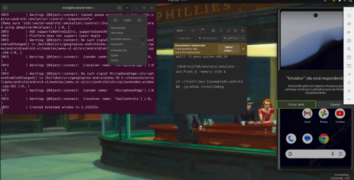
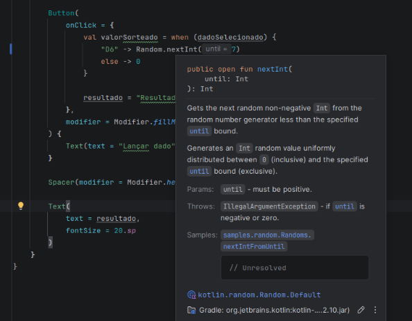
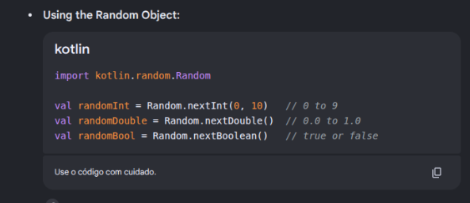
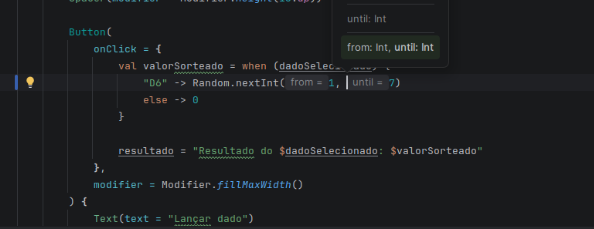
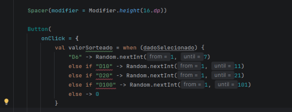
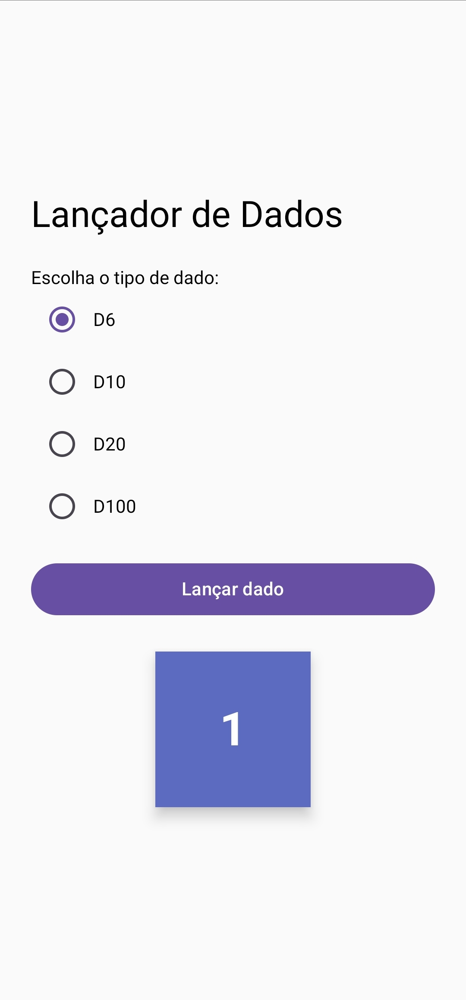
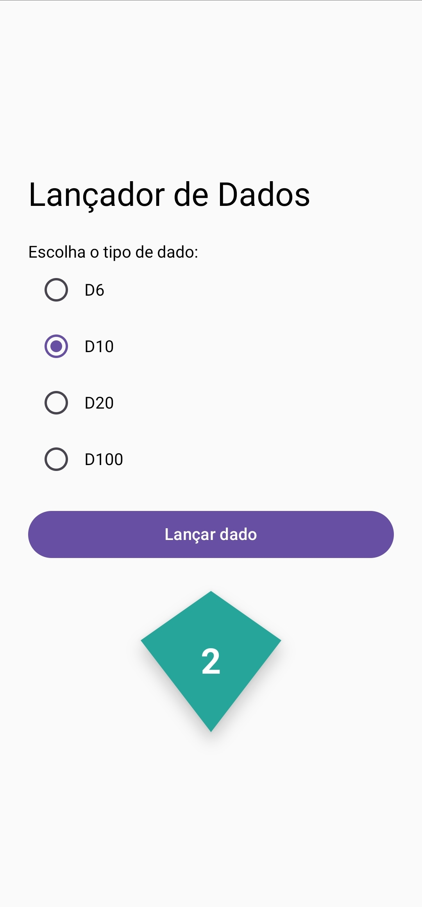
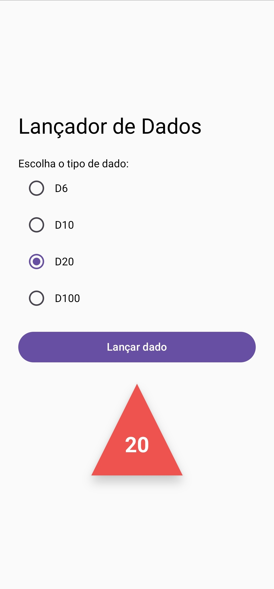
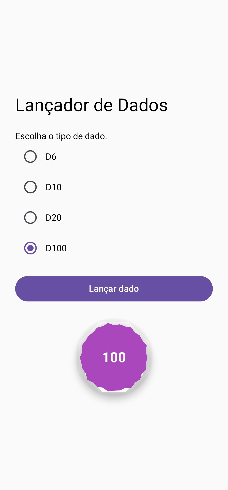

# ponderada-base-m10-01

## Relatório Ponderada

Antes de começar a ponderada, eu já estava com o Android Studio instalado e resolvi praticar com o exercício para a ponderada. Para reforçar o que aprendi de Kotlin, comecei identificando a tela principal (MainActivity.kt), o que é intuitivo pelo nome, mas busquei entender de forma mais aprofundada como ela é referenciada no código como a tela principal. Usei LLM para me ajudar nesse exercício de autoestudo, pude entender que no AndroidManifest.xml, a tela principal é referenciada com o “intent.category.LAUNCHER”.

Depois disso, fui executar o app no emulador. Como eu ainda não tinha nenhum dispositivo conectado, eu precisava adicionar um dispositivo, acabei adicionando o pixel 9. Quando instalou, fiz o build, supostamente estava correto mas não consegui interagir no simulador, a tela estava congelada. Busquei fazer as mudanças necessárias do desafio e depois voltei para testar novamente e não funcionou. Ouvi o Fernando falando que o Pixel 6 era mais leve e ideal para as simulações, então resolvi instalar o novo dispositivo, demorou bastante para instalar e quando finalizou tentei novamente e deu o mesmo erro. Meu notebook ficou muito lento e travado, quase crashou. Tentei outras vezes e seguiu sem funcionar, busquei alternativas para rodar o emulador sem depender do android studio, funcionou, ficou mais leve, cheguei a utilizar alguns aplicativos mas no fim acabou ficando muito travado e não funcionou. Acredito que estava no caminho de solucionar para emular mas cheguei a conclusão que faria mais sentido fazer com o físico.



Após muito tempo tentando resolver decidi fazer pelo meu próprio celular, queria utilizar um dos tablets mas não havia mais disponíveis. Assim, ativei o modo de desenvolvedor. Com isso, pude testar o app tranquilamente e ver que estava funcionando perfeitamente de acordo com como configurei e corrigi o problema do exercício. 


Com essa primeira atividade realizada, parti para a realização da ponderada. Meu primeiro passo foi conectar meu celular e rodar o sistema no meu celular. Fui testar para ver se estava funcionando ou se o bug iria aparecer de cara. Notei que estava funcionando mas saí “jogando vários dados” e notei que por vezes caía 0 (o que não deveria acontecer em um D6. deve ir de 1 a 6) e depois notei que nunca caía 6. Então fui ao código, vi que esse random: 

```java
val valorSorteado = when (dadoSelecionado) {
   "D6" -> Random.nextInt(6)
   else -> 0
}
```

só ia até 6. Suspeitei que deveria apenas incrementar um, para ficar até 7, mas coloquei o mouse em hover sobre a função e pude confirmar a minha suspeita:



A função deixa claro que só retorna um número inteiro não negativo menor do que o limite especificado, então com o limite antigo sendo 6, só retornava valores de 0 a 5.

Beleza, resolvi o problema para o D6 ir até 6 mas precisava resolver a questão dele retornar 0, então busquei entender melhor como funcionava o random do kotlin. Busquei no google e a IA do google me deu uma pista




Assim, tentei colocar um início de 1, indo até 7, mas quando eu coloquei o 1 apareceu um autocomplete do Android Studio mantendo com os seguintes parameters hints: 



Com isso feito, pude seguir para adicionar o D10, D20 e D100. A minha intuição inicial era de modificar a condicional when da seguinte forma, utilizando else if:



Mas, novamente com uma pesquisa rápida sobre a condicional when no kotlin eu pude ver um exemplo que mostrava que a forma correta era ainda mais simples do que eu imaginava. Implementei isso, testei e pude ver que estava tudo funcionando corretamente, agora resta apenas o último passo, de exibir uma representação visual das faces de acordo com cada dado.

Em vez de representar com imagens ou algo do tipo, busquei trabalhar com representação das faces com as formas geométricas. Por exemplo, para um d6 a face é um quadrado, para um d20 um triângulo. D10 e D100 possuem representações mais irregulares, porém ainda é possível de ser representado. Assim, busquei por “kotlin geometric forms” e encontrei essa documentação como referência: https://developer.android.com/develop/ui/compose/graphics/draw/shapes?hl=pt-br

Vi alguns exemplos de como implementar as faces mais simples, de d6 ou d20, como esse:

```java
@Composable
fun D20Face(result: String) {
    Box(
        modifier = Modifier
            .size(100.dp)
            .clip(GenericShape { size, _ ->
                moveTo(size.width / 2f, 0f)             // Topo central
                lineTo(size.width, size.height)         // Canto inferior direito
                lineTo(0f, size.height)                // Canto inferior esquerdo
                close()
            })
            .background(Color.Blue),
        contentAlignment = Alignment.Center
    ) {
        Text(text = result, color = Color.White, fontWeight = FontWeight.Bold)
    }
}
```

Para todas as faces, era preciso seguir esse padrão com o @Composable e Box. Com os requisitos e estrutura bem definida, usei IA para estruturar o código de "DiceFaces.kt" para gerar a representação visual das faces dos dados, seguindo esse padrão. No fim, resolvi refinar a aparência dos resultados e adicionei efeitos de sombra e melhorias nas animações ao "rolar o dado". 

Aqui estão os exemplos de como ficou a aplicação:







